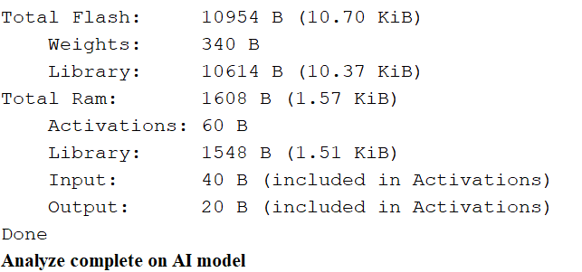
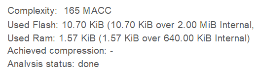
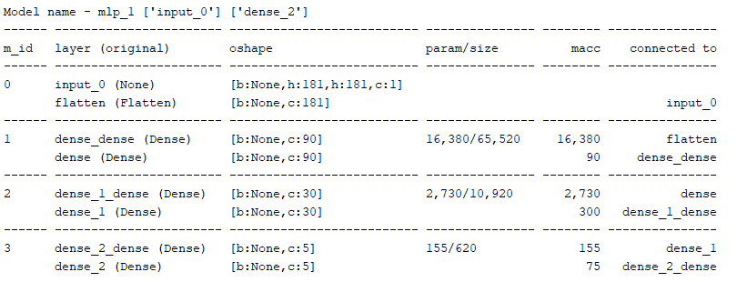
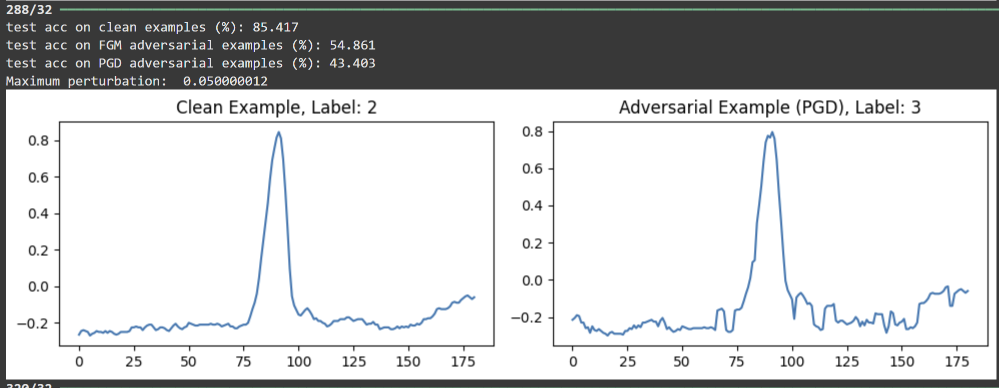
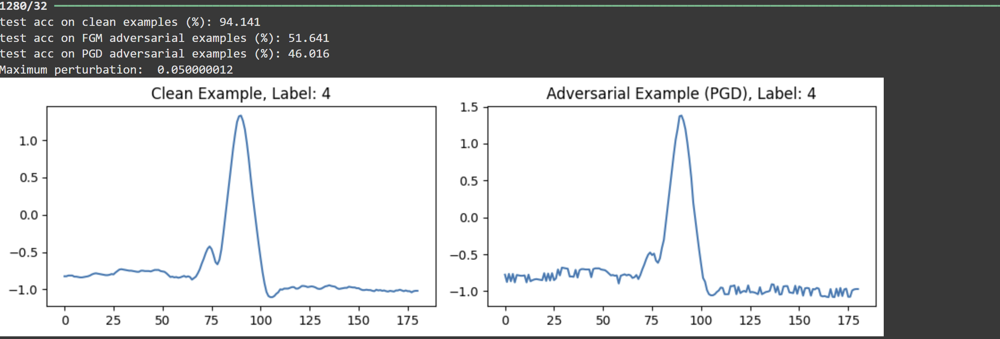
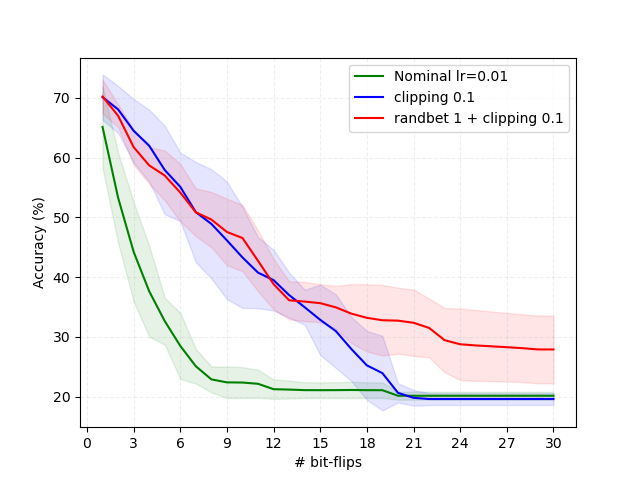
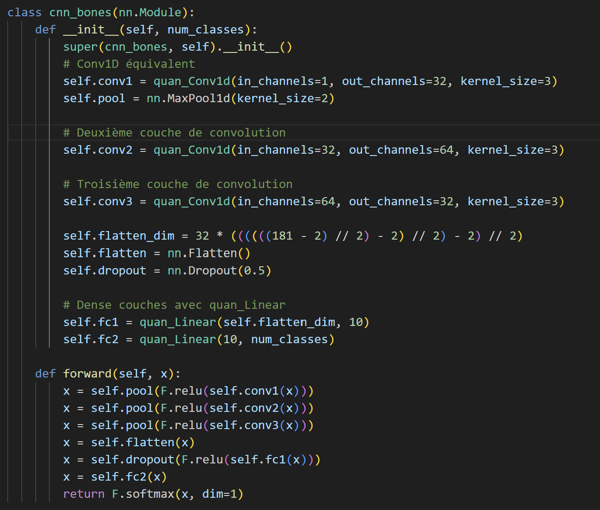

  <h2 style="font-size: 2.5em;">Embedded Neural Network on MCU
</h2>

  <h4>Ecole Nationale Superieure des Mines de Saint-Etienne</h4>

  <h4>3ème année</h4>

  <h3>Sommaire</h3>

<h5>Introduction<h5>
<h5>Modification du MLP<h5>
<h5>Analyse du MLP<h5>
<h5>Inférence du MLP<h5>
<h5>Création du CNN<h5>
<h5>Adversarial Attacks sur CNN & MLP<h5>
<h5>Bit-Flip Attack sur CNN<h5>
  

  <h2 style="font-size: 2.5em;">Introduction</h2>

L'objectif de ce projet consistait dans un premier temps à étudier rapidement le fonctionnement d'un réseau de neuronne détectant des défaillances cradiaques chez un patient, puis d'y effectuer l'analyse ainsi que l'inférence sur une carte STM 32 avec des données tests afin de valider le processus de développement d'un modèle pour une implémentation sur un appareil embarqué. Cette démarche est en accord avec notre majeur "Embedded System" et notre formation aux Mines de Saint-Etienne. Ce développement est également accompagné d'un aspect sécurité des modèles de neuronne développés, notamment avec l'apprentissage et l'application de plusieurs attaques pour démontrer la nécessité de les protéger.

  <h2 style="font-size: 2.5em;">Modification du MLP</h2>

  <h3>Chronologie et évolutions</h3>

- **01/10/2024** : Modification du MLP avec l'ajout d'une couche intermédiaire. On a obtenu une accuracy sur les données de validation de 91%. [mlp](mlp.ipynb)
  

  <h3 style="font-size: 2.5em;">Amélioration du MLP</h3>

En nous inspirant de l'article du MIT qui souligne l'importance des couches intermédiaires, et dans l'intérêt d'augmenter les performances du MLP donné en cours, nous avons décidé de rajouter une couche dense avec une fonction d'activation tangente hyperbolique. L'intérêt de cette couche intermédiaire avec cette fonction d'activation réside en particulier à accélérer la convergence lors de l'entraînement du modèle.[mlp](mlp.ipynb)

Suite aux modifications, nous avons ainsi réussi à augmenter l'accuracy de 6%, en passant de 85% à 91%

  <h2 style="font-size: 2.5em;">Analyse du MLP</h2>

  <h3>Chronologie et évolutions</h3>

- **02/10/2024** : Analyse sur STM IDE pour implémentation sur la carte
  

  <h3>Analyse pour vérifier la structure & la portabilité du modèle</h3>

Après avoir choisi notre MCU et configuré notre modèle sur le logiciel STM32 Cube MX avec notre MLP ainsi que les données d'entrée et de sortie, nous avons pu procéder à une analyse détaillée de notre modèle, de sa structure ainsi que de la place que celui prend sur la mémoire Flash ainsi que sur la RAM. On constate ainsi que nous sommes très largement dans les limites de stockage pour notre modèle (0.5% de la Flash est utilisé et 0.25% de la RAM).

Il n'est donc pas nécéssairement utile de procéder à une compression / ou à effectuer du "pruning" pour gagner en ressources et diminuer la taille de notre modèle pour des besoins de stockage ( le MLP modifié est déjà bien optimisé).

En ce qui concerne la structure de notre MLP, on peut observer les trois couches "Dense" avec la couche intermédiaire rajoutée. On peut également observer le nombre de paramètres (environ 19,000 paramètres).

  <h2 style="font-size: 2.5em;">Inférence du MLP</h2>

  <h3>Chronologie et évolutions</h3>

- **17/10/2024** : Phase d'inférence du MLP sur la STM32 -> Accuracy sur les données tests de 83%.[mlp](mlp.ipynb)

  <h3>Résultats de l'inférence</h3>

Il s'agit de l'étape centrale de notre projet, à savoir l'implémentation de notre modèle MLP sur la STM32. Après avoir "buildé" et téléversé le code sur la carte STM, on peut observer la phase d'inférence de notre MLP depuis le Jupyter Notebook.[mlp](mlp.ipynb). On récupère les données de notre inférence via la liaison série directement sur le Notebook. Ainsi, au bout de 100 itérations sur les données tests, nous obtenons une accuracy respectable de 83% pour notre MLP.

  

  <h2 style="font-size: 2.5em;">Création du CNN</h2>

  <h3>Chronologie et évolutions</h3>

- **29/10/2024** : Début de conception du CNN basé sur un de mes projets personnels (il s'agit d'un CNN 2D qui analyse des images médicales pour détection de tumeurs (Gliome, ...). 

- **02/11/2024** : l'adaptation du CNN en un modèle 1D est terminée, avec une accuracy sur les données de validation de 92,6%. [cnn](cnn.ipynb)
  

  <h3 style="font-size: 2.5em;">Conception du CNN</h3>

Pour la suite du projet, nous avons décidé de construire un CNN concurrent du MLP pour essayer de comparer les deux modèles, notamment sur leurs performances respectives. En me basant sur les recommendations de l'article du MIT et en reprenant un modèle que j'avais précédemment construit pour un projet personnel permettant de la détection de tumeur (imagerie médicale), nous avons réussi à l'adapter à notre projet (conversion du modèle convolutionnel 2D en un modèle 1D). Il est composé de 3 couches convolutionnelle 1D avec des fonctions 'relu' comme fonction d'activation et un dropout permettant une généralisation. Grâce à ce nouveau CNN (qui nous servira pour les attaques), nous avons obtenu une accuracy sur les données de validation proche de 93%, soit supérieur à ce que l'on a obtenu avec le MLP modifié (91 %).[cnn](cnn.ipynb)

Il a également l'avantage d'avoir une meilleure accuracy en ayant moins de 16,000 paramètres contre 19,200 paramètres pour le MLP. La Loss de 0.25 est identique dans les deux modèles

  <h2 style="font-size: 2.5em;">Adversarial Attacks sur CNN & MLP</h2>

  <h3>Chronologie et évolutions</h3>

- **10/11/2024** : Début des attaques sur le CNN = Modification de l'attaque de base pour l'adapter à notre CNN 1D.
- **11/11/2024** : Adversarial attack sur le CNN = Détermination globale des accuracy pour les attaques PGD et FGSM [attack_adversarial_cnn.ipynb](attack_adversarial_cnn.ipynb)
- **11/11/2024** : Adversarial attack sur le CNN = attaques PGD et FGSM avec affichage des labels [complete_attack_adversarial_cnn.ipynb](complete_attack_adversarial_cnn.ipynb)
- **11/11/2024** : Adversarial attack sur le MLP = attaques PGD et FGSM avec affichage des labels [complete_attack_adversarial_mlp.ipynb](complete_attack_adversarial_mlp.ipynb)
  

  <h3 style="font-size: 2.5em;">Adversarial Attacks sur CNN & MLP: le déroulement de l'attaque</h3>

Tout d'abord, donnons une définition de ce qu'est une "Adversarial attack": il s'agit d'une méthode qui vise à tromper un modèle dans sa phase d'apprentissage en introduisant des perturbations (modulables), notamment dans les données d'entrée, amenant le modèle à se tromper sur le véritable label. Ces attaques visent donc à dégrader la classification. Dans le cas étudié en cours, ces attaques s'effectuent sur les paramètres et l'architecture de notre modèle: nous avons donc utilisé 2 types d'attaque, à savoir FGSM pour "Fast Gradient Sign Method" et PGD pour "Projected Gradient Descent". L'attaque FGSM introduit une perturbation qui est proportionnelle au gradient de la Loss par rapport à l'entrée. L'attaque PGD est une variante de la précédente attaque: il s'agit d'une version itérative de FGSM où à chaque étape, on limite les perturbations avec une norme.

Un premier travail consistait à déterminer de manière globale l'accuracy pour le CNN. 

Détermination globale des accuracy pour les attaques PGD et FGSM sur le CNN [attack_adversarial_cnn.ipynb](attack_adversarial_cnn.ipynb)
- Valeur **Clean accuracy** : 90.92%
- **Adversarial accuracy (FGSM)** : 53.08%
- **Adversarial accuracy (PGD)** : 36.80%
- **Max perturbation for FGSM** : 0.0500
- **Max perturbation for PGD** : 0.0500

Globalement, on constate que notre modèle est plus résistant que prévu. Dans l'exemple vu en cours (le CNN Cipher10), nous étions sur 21 % d'accuracy pour l'attaque FGSM et 9 % d'accuracy pour l'attaque PGD. Le modèle est plus robuste que prévu !
 
Adversarial attack sur le CNN = attaques PGD et FGSM avec affichage des labels  [complete_attack_adversarial_cnn.ipynb](complete_attack_adversarial_cnn.ipynb)
  
  

Encore une fois, on remarque que le MLP modifié résiste plutôt bien aux attaques (même si l'accuracy est quasiment divisée par 2).

Adversarial attack sur le MLP = attaques PGD et FGSM avec affichage des labels [complete_attack_adversarial_mlp.ipynb](complete_attack_adversarial_mlp.ipynb)

  

  

  <h2 style="font-size: 2.5em;">Bit-Flip Attack sur CNN</h2>

  

<h3>Chronologie et évolutions</h3>

- **13/11/2024** : Bit-Flip Attack sur le CNN = les attaques ont mis en évidence la nécessité de protéger les modèles!

  <h3 style="font-size: 2.5em;">Bit-Flips Attack sur CNN: le déroulement de l'attaque</h3>

L'objectif des attaques par Bit-Flips consiste à exploiter les vulnérabilités des poids de notre réseau de neurones convolutifs, et ainsi induire des erreurs sur les "poids critiques". Le deuxième intérêt réside à montrer la robustesse de notre modèle lors qu'il est perturbé.

Pour protéger les CNN contre ces attaques (parfois minimes mais efficaces), il est important de mettre en place des méthodes de protection en introduisant des techniques comme le Clipping. Le Clipping est une technique de protection visant à empêcher la disparition du gradient lors d'un entraînement. Ce dernier favorise également la stabilité d'apprentissage. Dans le cas de notre modèle CNN, les attaques ont mis en évidence la fragilité de notre modèle face aux attaques de type Bit-Flips.

En effet, on constate une légère amélioration de l'accuracy sur les 18 premiers Bit-Flips, avant d'avoir à nouveau une chute totale de l'accuracy. En combinant le Randbet avec le clipping, on arrive toutefois à améliorer l'accuracy pour un plus grand nombre de Bit-Flips. Contrairement à "l'adversarial attack" étudié précédemment, notre CNN est moins robuste par rapport au modèle proposé initialement pour l'attaque.  

Voici ci-dessous le CNN écrit avec PyTorch présent dans le code pour l'attaque, l'ancien modèle a donc été remplacé par le notre, plus complexe avec plus de couches.

Fin du Projet

